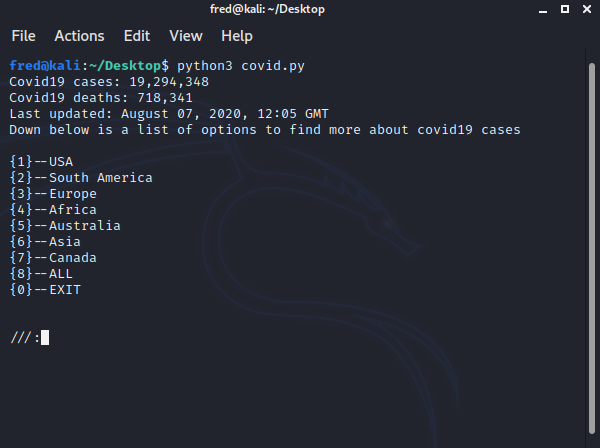
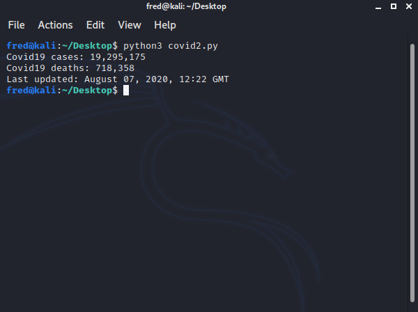

# Covid19-Tracker
Tracks the cases and deaths of covid19 using python webscraping.

If you just want cases and deaths worldwide, use "covid2.py"

INSTALLATION = 
$ git clone https://github.com/fred415/Covid19-Tracker.git
$ python3 covid.py

REQUIREMENTS = 
python3, BeautifulSoup, requests

Credit: https://www.worldometers.info/coronavirus/#countries 
